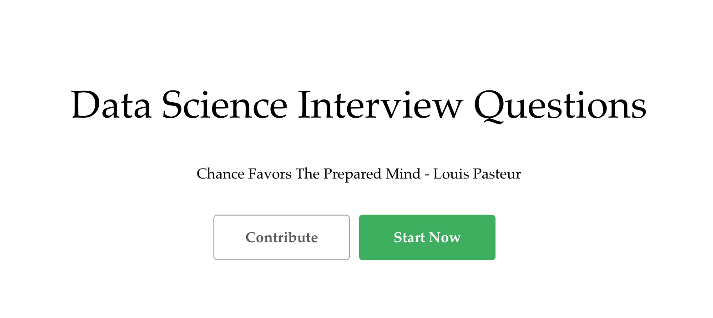
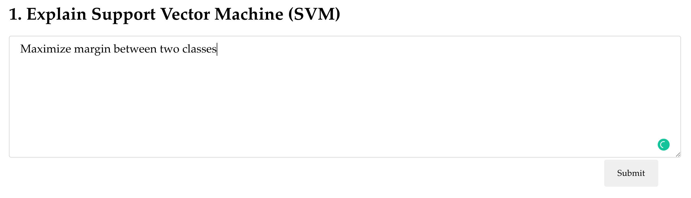
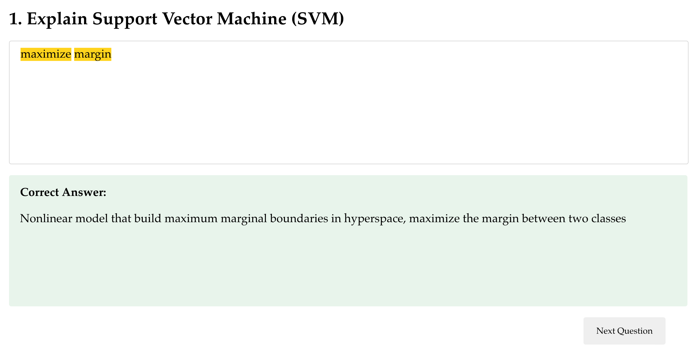

# Data Science Interview Preparation Website
A website that helps practice Data Science interview questions

Check out the website [here](https://ds-interview-fdcb3.web.app/)

## Features

### 1. Practice questions

A random question is fetched from the database and the user can type their answers in the text box.

After the users submitting their answers, the correct answers will be displayed and matching strings in the answer will be highlighted. The highlight feature is supported by the [react-highlight-words](https://github.com/bvaughn/react-highlight-words) package.

### 2. Contribute questions

## Techstack
1. [React](https://reactjs.org/): A JavaScript library for building user interfaces
2. [Firebase Real-time Database](https://firebase.google.com/docs/database): A cloud-hosted database. Data is stored as JSON and synchronized in realtime to every connected client
3. [Firebase Hosting](https://firebase.google.com/docs/hosting):  A production-grade web content hosting for developers
