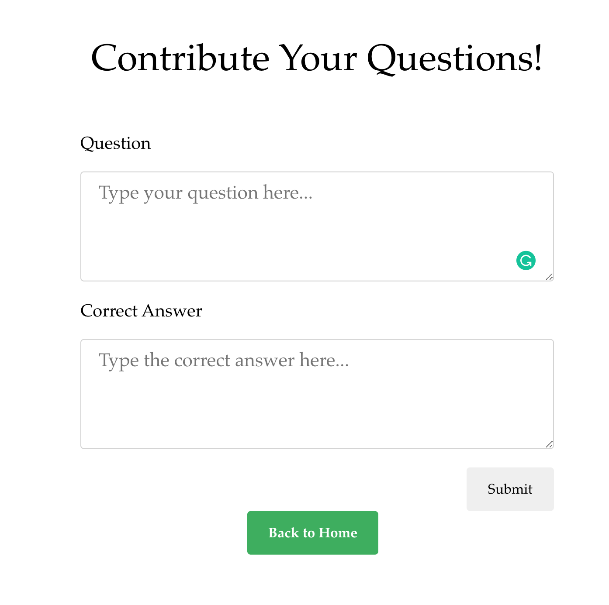
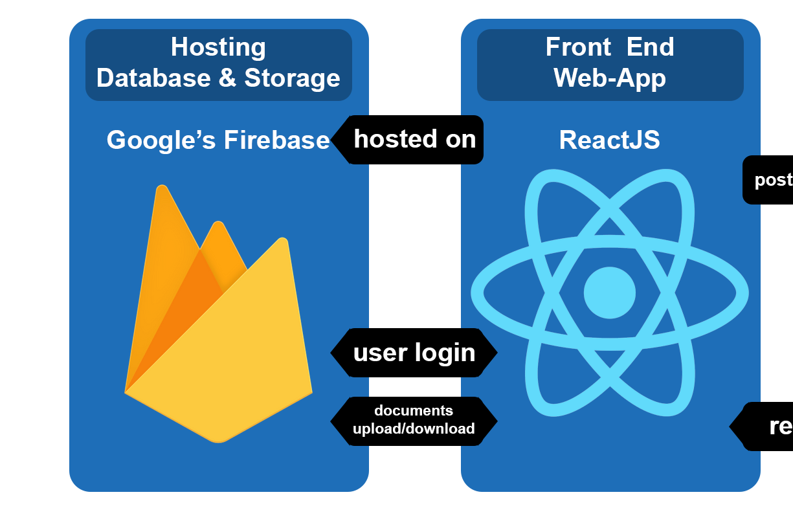

# Data Science Interview Preparation Website
A website that helps practice Data Science interview questions

Check out the website [here](https://ds-interview-fdcb3.web.app/)

## Features
### 1. Practice questions
A random question is fetched from the database and the users can type their answers in the text box.

After the users submitting their answers, the correct answers will be displayed and the matching strings in the answer will be highlighted. The highlight feature is supported by the [react-highlight-words](https://github.com/bvaughn/react-highlight-words) package.

### 2. Contribute questions
Users can contribute their questions to the website. The response will be posted to the database and reviewed by the admin.

## Architecture

1. [React](https://reactjs.org/): A JavaScript library for building user interfaces
2. [Firebase Real-time Database](https://firebase.google.com/docs/database): A cloud-hosted database. Data is stored as JSON and synchronized in realtime to every connected client
3. [Firebase Hosting](https://firebase.google.com/docs/hosting):  A production-grade web content hosting for developers

## In-development Features
1. Contribution feature - post form to Firebase
2. Add tags for questions
3. Search questions by title & tags
4. Report incorrect questions

## Contributing

Please let me know if you want to contribute to this project!
